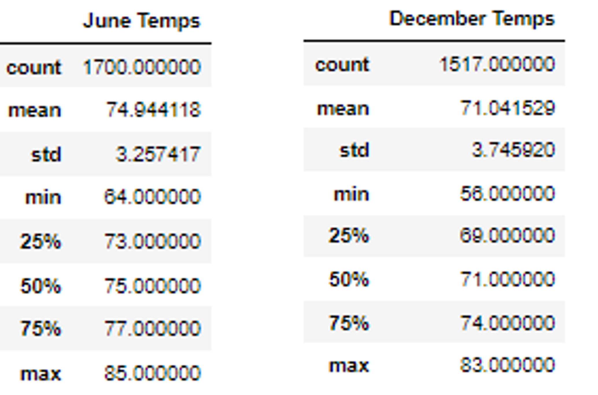

# surfs_up
## Overview of the analysis:
### Explain the purpose of this analysis.
We will be analysing the temperatures of Oahu specifically on June and December. The idea is to establish a business around the ideas of surfing and ice cream selling.

## Results:
###  Provide a bulleted list with three major points from the two analysis deliverables.
* The temperature for June has a mean of 75 with a standard deviation of 3.25. Therefore, temperature is quite stable during June.
* The temperature for December has a mean of 71 with a standard deviation of 3.74. This means temperature is a bit colder on december with a bit more variability.
* Temperature during June and December is good enough for people wanting ice cream, so the business idea could be good regarding location.

Data was gathered from the following tables: 

## Summary: 
### Provide a high-level summary of the results and two additional queries that you would perform to gather more weather data for June and December
The additional queries given will be about precipitation to complement the weather data gathered. The precipitation for June and December respectively is 0.13 and 0.21. That shows that precipitation will not influence in a possible risk for the business. Anyhow, there will need to be more data in the investigation made to understand if the business is a good idea. Some of this variables that are also around weather and nature would be if these beaches have enough waves for people to wanna surf there and if beaches are nice such that people want to visit and enjoy their day eating ice cream.
